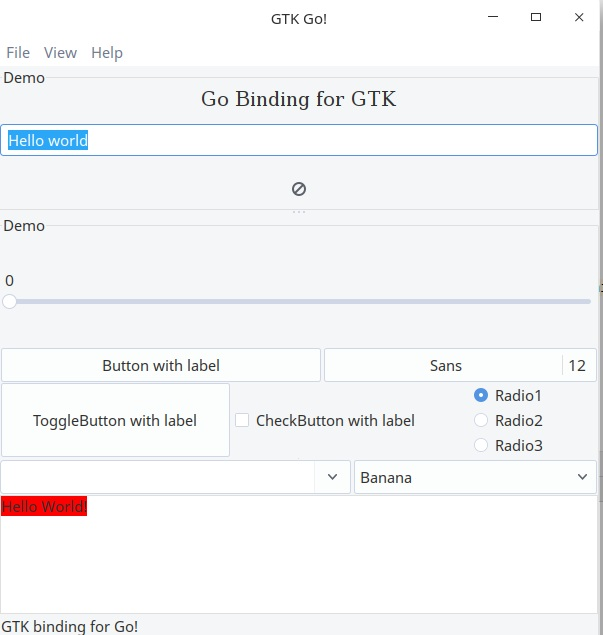

## about go-gtk example

http://mattn.github.io/go-gtk/

First install `sudo apt install libgtk2.0-dev` in your deepin linux

then run `go mod download` to install the dependency

finall run `go build example.go` to compile and test.

